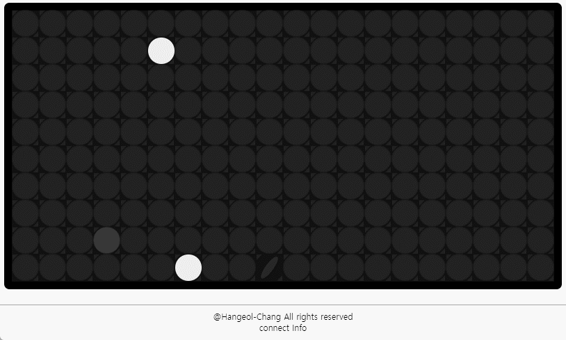

# 💿 Flip Dot Display

<div align="center">
    <a href="https://flipdots.vercel.app/example"
        style="
            background-color : #222222;
            border : 3px solid black;
            color : white;
            width : 200px;
            border-radius : 40px;
            padding : 5px;
            display : flex;
            flex-direction : column;
        "
    >
        try 💿 flip dot 💿 
    </a>         
</div>

<div align="center">
    


</div>

<hr>
<div align="center">
    <h4> flip-dot display로 깃허브를 꾸며보세요! </h4>
    이제 GitHub README.md에서 바로 사용할 수 있는 애니메이션 SVG API를 제공합니다!
    <br>
    <a href="https://flipdots.vercel.app/example">📖 API 사용법 보기</a>
</div>
<br>



## 🚀 새로운 SVG API 기능

GitHub README.md에 직접 임베드할 수 있는 flip dot 이미지를 생성하는 API입니다.
실제 flip-dot 하드웨어의 동작을 재현한 4가지 애니메이션 모드를 지원합니다.

### 기본 사용법

```markdown
https://flipdots.vercel.app/api/svg?text=YOUR_TEXT&style=dark
```

### 애니메이션 사용법

```markdown
https://flipdots.vercel.app/api/svg?text=HELLO%20WORLD&animationMode=scroll&style=retro
```

## 📋 파라미터

### 📝 텍스트 파라미터
- **`text`**: 표시할 텍스트 (영문자, 숫자, 특수문자 지원)
  - 여러 줄: `%0`으로 줄바꿈 (예: `LINE1%0LINE2%0LINE3`)
- **`customdots`**: 커스텀 dot 패턴 (예: `10110,01001,10110`)

### 🎨 스타일 파라미터
- **`style`**: 스타일 테마 (`light`, `retro`, `modern`, `dark`) - 기본값: `dark`
- **`dotSize`**: 각 dot의 크기 (10-40px, 기본값: 20)
- **`spacing`**: dot 간의 간격 (1-10px, 기본값: 2)

### 📐 크기 및 정렬 파라미터
- **`row`**: 행 개수 제한 (예: 10)
- **`column`**: 열 개수 제한 (예: 20)
- **`align`**: 세로 정렬 (`start`, `center`, `end`) - 기본값: `start`
  - row가 텍스트 높이보다 클 때 위아래 정렬
- **`justify`**: 가로 정렬 (`start`, `center`, `end`) - 기본값: `start`
  - 여러 줄이나 column이 텍스트 너비보다 클 때 좌우 정렬

### 🎬 애니메이션 파라미터
- **`animationMode`**: 애니메이션 모드
  - `static`: 정적 표시 (기본값)
  - `sequential`: 순차적 flip 애니메이션
  - `scroll`: 스크롤 텍스트 애니메이션
  - `waterfall`: 위에서 아래로 떨어지는 애니메이션
- **`speed`**: 애니메이션 속도 (0.5-3.0, 기본값: 1.0)
- **`direction`**: 애니메이션 방향
  - `normal`: 기본 방향 (오른쪽→왼쪽 또는 아래→위)
  - `reverse`: 반대 방향 (왼쪽→오른쪽 또는 위→아래)

### 🎨 커스텀 색상 파라미터
- **`dotOn`**: 켜진 dot의 색상 (hex 코드, # 생략 가능)
  - 단일 색상: `ff0000` (빨간색)
  - 그라디언트: `ff0000,00ff00,0000ff` (빨강→초록→파랑)
- **`dotOff`**: 꺼진 dot의 색상 (hex 코드, # 생략 가능)
- **`background`**: 배경 색상 (hex 코드, # 생략 가능)

## 🎭 스타일 예제

### 기본 스타일들


```markdown
https://flipdots.vercel.app/api/svg?text=LIGHT&style=light&dotSize=20&spacing=2
```


```markdown
https://flipdots.vercel.app/api/svg?text=RETRO&style=retro&dotSize=20&spacing=2
```

```markdown
https://flipdots.vercel.app/api/svg?text=MODERN&style=modern&dotSize=20&spacing=2
```


```markdown
https://flipdots.vercel.app/api/svg?text=DARK&style=dark&dotSize=20&spacing=2
```


### 커스텀 색상


```markdown
https://flipdots.vercel.app/api/svg?text=CUSTOM&dotOn=ff0000&background=000000&dotSize=20&spacing=2
```


```markdown
https://flipdots.vercel.app/api/svg?text=RAINBOW&dotOn=ff0000,ff8000,ffff00,00ff00,0000ff,8000ff&background=000000&dotSize=18&spacing=2
```


```markdown
https://flipdots.vercel.app/api/svg?text=PURPLE&dotOn=ff00ff&dotOff=330033&background=1a0a1a&dotSize=22&spacing=2
```

## 🎬 애니메이션 예제

### Sequential Animation (순차 애니메이션)
실제 flip-dot처럼 각 dot가 순차적으로 뒤집히는 애니메이션


```markdown
https://flipdots.vercel.app/api/svg?text=SEQUENTIAL&animationMode=sequential&style=retro&dotSize=18&spacing=2
```

### Scroll Animation (스크롤 애니메이션)
텍스트가 오른쪽에서 왼쪽으로 스크롤되는 애니메이션


```markdown
https://flipdots.vercel.app/api/svg?text=HELLO_WORLD!&animationMode=scroll&style=modern&dotSize=16&spacing=1

### Waterfall Animation (폭포 애니메이션)
텍스트가 위에서 아래로 떨어지는 애니메이션


```markdown
https://flipdots.vercel.app/api/svg?text=FALLING&animationMode=waterfall&style=dark&dotSize=18&spacing=2
```

## 📝 여러 줄 텍스트

`%0`을 구분자로 사용하여 여러 줄 텍스트를 만들 수 있습니다. 각 줄 사이에는 1 dot 간격이 자동으로 추가됩니다.

### 기본 여러 줄

```markdown
https://flipdots.vercel.app/api/svg?text=HELLO%0WORLD&style=dark&dotSize=18&spacing=2
```

### 3줄 텍스트

```markdown
https://flipdots.vercel.app/api/svg?text=LINE1%0LINE2%0LINE3&style=modern&dotSize=16&spacing=2
```

### 여러 줄 + 애니메이션

```markdown
https://flipdots.vercel.app/api/svg?text=GITHUB%0PROFILE%0VISITOR&animationMode=sequential&style=retro&dotSize=16&spacing=2
```

## 📐 크기 제한 및 정렬

### 고정 크기 매트릭스
행과 열을 제한하여 고정 크기의 디스플레이를 만들 수 있습니다.


```markdown
https://flipdots.vercel.app/api/svg?text=FIXED&row=10&column=25&style=dark&dotSize=16&spacing=2
```

### 가운데 정렬

```markdown
https://flipdots.vercel.app/api/svg?text=CENTER&row=12&column=30&align=center&justify=center&style=modern&dotSize=18&spacing=2
```

### 여러 줄 정렬

```markdown
https://flipdots.vercel.app/api/svg?text=LEFT%0CENTER%0RIGHT&row=15&column=35&align=center&justify=center&style=retro&dotSize=16&spacing=2
```

### 오른쪽 아래 정렬

```markdown
https://flipdots.vercel.app/api/svg?text=BOTTOM%0RIGHT&row=15&column=40&align=end&justify=end&style=dark&dotSize=16&spacing=2
```

## 🎨 커스텀 도트 패턴

텍스트 대신 직접 도트 패턴을 정의할 수 있습니다. `1`은 켜진 도트, `0`은 꺼진 도트를 의미하며, 콤마로 행을 구분합니다.

### 하트 모양

```markdown
https://flipdots.vercel.app/api/svg?customdots=01101100,11111110,11111110,01111100,00111000,00010000&style=dark&dotOn=ff69b4&dotSize=20&spacing=2
```

### 체크마크

```markdown
https://flipdots.vercel.app/api/svg?customdots=00000010,00000110,00001100,10011000,11110000,01100000&style=modern&dotOn=00ff00&dotSize=18&spacing=2
```

### 별 모양

```markdown
https://flipdots.vercel.app/api/svg?customdots=00100000100,00010001000,00111111100,01101110110,11111111111,10111111101,10100000101,00011011000&style=dark&dotOn=ffff00&dotSize=16&spacing=2
```

### 커스텀 패턴 + 애니메이션

```markdown
https://flipdots.vercel.app/api/svg?customdots=10110,01001,10110&animationMode=sequential&style=retro&dotSize=22&spacing=3
```

## ✨ 특수 기능

### 띄어쓰기 및 특수문자
- **띄어쓰기**: 공백 또는 `_` (언더스코어) 사용
- **특수문자**: `! ? . , : ; - + = * / \ ( ) [ ] @ # $ % &` 지원
- **URL 인코딩**: 특수문자가 URL에서 자동으로 인코딩되어도 정상 처리


```markdown
https://flipdots.vercel.app/api/svg?text=HELLO_WORLD!&style=dark&dotSize=18&spacing=2
```


```markdown
https://flipdots.vercel.app/api/svg?text=GITHUB.COM/USER&style=modern&dotSize=16&spacing=2
```


```markdown
https://flipdots.vercel.app/api/svg?text=SCORE:_100%25&style=retro&dotSize=18&spacing=2
```

*참고: URL에서 `%`는 `%25`로 인코딩됩니다.*

## 💡 실용적인 사용 사례

### GitHub 프로필 꾸미기

#### 방문자 환영 메시지

```markdown

```

#### 현재 상태 표시

```markdown

```

#### 개발자 정보

```markdown

```

### 프로젝트 README 헤더

#### 프로젝트 제목

```markdown

```

#### API 문서 헤더

```markdown

```

### 상태 배지 스타일

#### 빌드 상태


```markdown


```

#### 버전 정보

```markdown

```

#### 완료율 표시

```markdown

```

### 창의적인 활용

#### 소셜 미디어 링크

```markdown

```

#### 이메일 주소

```markdown

```

#### 기술 스택 표시

```markdown

```

#### 현재 학습 중

```markdown


## 🛠️ 고급 사용법

### 정렬 조합
다양한 정렬 옵션을 조합하여 원하는 레이아웃을 만들 수 있습니다:

```markdown
<!-- 왼쪽 위 -->
?align=start&justify=start

<!-- 가운데 위 -->
?align=start&justify=center

<!-- 오른쪽 위 -->
?align=start&justify=end

<!-- 왼쪽 가운데 -->
?align=center&justify=start

<!-- 정중앙 -->
?align=center&justify=center

<!-- 오른쪽 가운데 -->
?align=center&justify=end

<!-- 왼쪽 아래 -->
?align=end&justify=start

<!-- 가운데 아래 -->
?align=end&justify=center

<!-- 오른쪽 아래 -->
?align=end&justify=end
```

### 그라디언트 효과
여러 색상을 콤마로 구분하여 무지개 효과를 만들 수 있습니다:


```markdown
https://flipdots.vercel.app/api/svg?text=RAINBOW&dotOn=ff0000,ff8000,ffff00,00ff00,0080ff,0000ff,8000ff&background=000000
```

### 애니메이션 속도 조절
속도 파라미터로 애니메이션의 빠르기를 조절할 수 있습니다:
```markdown
<!-- 느린 애니메이션 -->
&speed=0.5

<!-- 보통 속도 (기본값) -->
&speed=1.0

<!-- 빠른 애니메이션 -->
&speed=2.0

<!-- 매우 빠른 애니메이션 -->
&speed=3.0

### 크기별 최적화
용도에 따른 권장 크기 설정:

```markdown
<!-- 작은 배지/아이콘 -->
&dotSize=12&spacing=1

<!-- 일반 텍스트 -->
&dotSize=16&spacing=2

<!-- 제목/헤더 -->
&dotSize=20&spacing=2

<!-- 대형 디스플레이 -->
&dotSize=24&spacing=3

<!-- 초대형 헤더 -->
&dotSize=30&spacing=4
```

### 반응형 디자인 팁

#### 모바일 친화적 크기
```markdown
<!-- 모바일에서도 잘 보이는 크기 -->
&dotSize=14&spacing=1

<!-- 태블릿 최적화 -->
&dotSize=18&spacing=2
```

#### GitHub 테마 호환
```markdown
<!-- GitHub 다크 모드 -->
&style=dark

<!-- GitHub 라이트 모드 -->
&style=light&dotOn=333333&background=ffffff

<!-- GitHub 컬러 스킴과 조화 -->
&dotOn=0366d6&background=f6f8fa&dotOff=d0d7de
```

## 💡 프로 팁

### 1. 캐싱 최적화
URL 끝에 버전 파라미터를 추가하여 캐싱을 제어하세요:
```markdown
&v=1  # 내용이 변경될 때 숫자를 증가시키세요
```

### 2. 특수문자 인코딩
URL에서 특수문자는 자동으로 인코딩됩니다:
- `%` → `%25`
- `@` → `%40`  
- `#` → `%23`
- `&` → `%26`

### 3. 여러 줄 텍스트 정렬 최적화
```markdown
<!-- 각 줄이 다른 길이일 때 가운데 정렬 -->
text=SHORT%0VERY_LONG_LINE%0MID&justify=center

<!-- 제목과 부제목 스타일 -->
text=MAIN_TITLE%0SUBTITLE&justify=center&row=12&column=40
```

### 4. 애니메이션 조합
```markdown
<!-- 스크롤 + 속도 조절 -->
&animationMode=scroll&speed=0.8&direction=reverse

<!-- 워터폴 + 고정 크기 -->
&animationMode=waterfall&row=20&column=30&align=center
```

### 5. 색상 조합 가이드
```markdown
<!-- 네온 효과 -->
&dotOn=00ffff&background=000011&dotOff=001122

<!-- 파스텔 톤 -->
&dotOn=ffb3ba&background=fff&dotOff=f0f0f0

<!-- 하이 콘트라스트 -->
&dotOn=ffffff&background=000000&dotOff=333333

<!-- 브랜드 컬러 매칭 -->
&dotOn=1da1f2&background=15202b&dotOff=192734  # Twitter 스타일
&dotOn=0366d6&background=f6f8fa&dotOff=d0d7de  # GitHub 스타일
```

## 🎯 성능 최적화

### 권장 설정
- **dotSize**: 12-24px (너무 크면 로딩 시간 증가)
- **spacing**: 1-3px (적절한 가독성 유지)
- **애니메이션**: 복잡한 텍스트에는 static 모드 권장
- **색상**: hex 코드 6자리 사용 권장 (3자리도 지원)

### 로딩 속도 개선
```markdown
<!-- 간단한 텍스트 사용 -->
text=HELLO  (좋음)
text=VERY_LONG_COMPLEX_TEXT_WITH_MANY_CHARACTERS  (느림)

<!-- 적절한 크기 설정 -->
&dotSize=16&spacing=2  (좋음)
&dotSize=40&spacing=10  (느림)
```

## 📖 기술 사양

### 지원하는 문자
- **영문 대문자**: A-Z
- **영문 소문자**: a-z  
- **숫자**: 0-9
- **특수문자**: `! ? . , : ; - + = * / \ ( ) [ ] @ # $ % &`
- **공백**: 띄어쓰기, 언더스코어(_)
- **여러 줄**: %0 구분자

### 애니메이션 특징
- **Sequential**: 대각선 순서로 순차 애니메이션 (0.08초 간격)
- **Scroll**: 오른쪽→왼쪽 스크롤, 문자별 0.5초 읽기 시간
- **Waterfall**: 위→아래 폭포 효과, 행별 순차 표시
- **Speed**: 0.5x ~ 3.0x 속도 조절 가능
- **Direction**: normal/reverse 방향 전환

### 색상 시스템
- **Hex 코드**: 6자리 (#ffffff) 또는 3자리 (#fff) 지원
- **자동 # 추가**: URL에서 # 기호 생략 가능
- **그라디언트**: 콤마로 구분된 다중 색상 지원
- **투명도**: rgba 미지원, hex만 지원

### 크기 제한
- **dotSize**: 10-40px
- **spacing**: 1-10px  
- **row/column**: 제한 없음 (성능상 100x100 권장)
- **텍스트 길이**: 제한 없음 (가독성상 50자 이내 권장)

### 브라우저 호환성
- **SVG 지원**: 모든 모던 브라우저
- **애니메이션**: CSS3 지원 브라우저
- **캐싱**: CDN을 통한 빠른 로딩
- **반응형**: 다양한 화면 크기 지원

## 🔧 개발자 정보

### API 엔드포인트
```
GET https://flipdots.vercel.app/api/svg
```

### 응답 형식
- **Content-Type**: `image/svg+xml`
- **Cache-Control**: `public, max-age=31536000, immutable`
- **Encoding**: UTF-8

### 예제 도구
[https://flipdots.vercel.app/example](https://flipdots.vercel.app/example)에서 실시간으로 파라미터를 조정하고 결과를 확인할 수 있습니다.

### GitHub 레포지토리
[https://github.com/Hangeol-Chang/flipdot](https://github.com/Hangeol-Chang/flipdot)

### 기술 스택
- **Frontend**: Next.js 15, React 18
- **Styling**: CSS3 Animations, SVG
- **Deployment**: Vercel
- **Font Mapping**: Custom bitmap fonts

## 🤝 기여하기

이 프로젝트는 오픈소스이며 여러분의 기여를 환영합니다!

### 기여 방법
1. 이 레포지토리를 Fork 하세요
2. 새로운 기능 브랜치를 생성하세요 (`git checkout -b feature/amazing-feature`)
3. 변경사항을 커밋하세요 (`git commit -m 'Add amazing feature'`)
4. 브랜치에 푸시하세요 (`git push origin feature/amazing-feature`)
5. Pull Request를 열어주세요

### 개선 아이디어
- [ ] 한글 폰트 지원
- [ ] 더 많은 애니메이션 모드
- [ ] 사용자 정의 폰트 업로드
- [ ] QR 코드 생성
- [ ] 이미지를 도트 패턴으로 변환
- [ ] 실시간 시계 표시
- [ ] 날씨 정보 연동

### 버그 리포트
버그를 발견하셨나요? [Issues](https://github.com/Hangeol-Chang/flipdot/issues)에서 리포트해주세요!

## � 라이센스

이 프로젝트는 MIT 라이센스 하에 배포됩니다. 자세한 내용은 [LICENSE](LICENSE) 파일을 참조하세요.

### 사용 조건
- ✅ 상업적 사용 가능
- ✅ 수정 및 배포 가능  
- ✅ 개인 프로젝트 사용 가능
- ✅ GitHub README에서 자유롭게 사용 가능

---

<div align="center">

**🎉 GitHub README를 flip-dot으로 멋지게 꾸며보세요! 🎉**

[](https://flipdots.vercel.app/example)

버그 리포트와 아이디어 제안, 풀 리퀘스트는 언제나 환영합니다.
<br>
📧 hgchang1@naver.com | 🐙 [@Hangeol-Chang](https://github.com/Hangeol-Chang)

⭐ 이 프로젝트가 도움이 되셨다면 별표를 눌러주세요!

</div>
