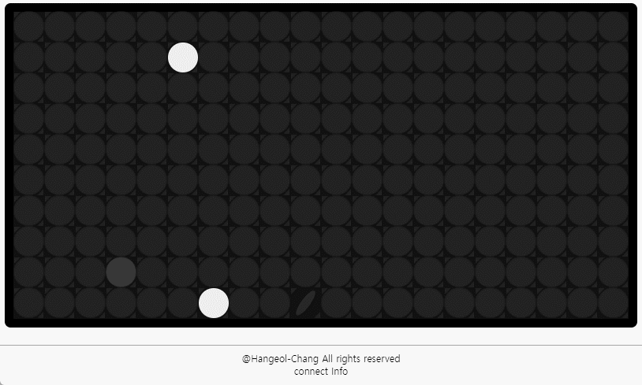

# Flip Dot

    <link href="https://flipdots.vercel.app">
            

                <h5 style="margin: 0px;"> Try </h5> 
                <h3 style="margin: 0px;"> 💿 flip dot 💿 </h3>
            

    </link>

    <h4> flip-dot display로 깃허브를 꾸며보세요! </h4>
    다양하게 활용할 수 있는 api가 준비되어 있습니다.
     
    사실 아직 준비되어있지는 않은데, 열심히 만들고 있습니다!

 

## Usage guide
> 더 밑으로 내리면 example이 준비되어 있습니다.

## Examples