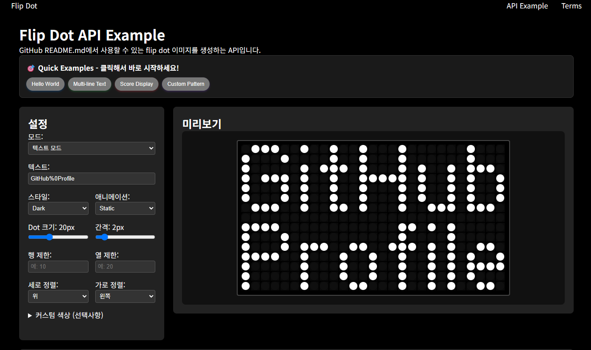

# 💿 Flip Dot Display

## 🌐 Other Languages
- [🇰🇷 한국어 (Korean)](./readme/README_kr.md)
- [🇯🇵 日本語 (Japanese)](./readme/README_jp
```
https://flipdots.vercel.app/api/svg?text=ALIGN%0A_BOTTOM%0ARIGHT&row=25&column=45&align=end&justify=end&style=retro&dotSize=16&spacing=2
```app/api/svg?text=HELLO%0AWORLD&style=dark&dotSize=18&spacing=2&v=2)
```
https://flipdots.vercel.app/api/svg?text=HELLO%0AWORLD&style=dark&dotSize=18&spacing=2
```md)
- [🇨🇳 中文 (Chinese)](./readme/README_cn.md)

<div align="center">
    <a href="https://flipdots.vercel.app/example"
        style="
            background-color : #222222;
            border : 3px solid black;
            color : white;
            width : 200px;
            border-radius : 40px;
            padding : 5px;
            display : flex;
            flex-direction : column;
            margin: 10px;
        "
    >
        try 💿 flip dot 💿 
    </a>         
</div>

<div align="center">
	<a href="https://github.com/Hangeol-Chang/flipdot"></a>
</div>

<div align="center">
    


</div>

<hr>
<div align="center">
    <h4> Decorate your GitHub with flip-dot display! </h4>
    Now providing animated SVG API that can be used directly in GitHub README.md!
    <br>
    <a href="https://flipdots.vercel.app/example">📖 View API Documentation</a>
</div>
<br>

<!--  -->
<div align="center" style="maxWidth:400px">
 
</div>

## 🚀 Key Features

An API that generates flip dot images that can be embedded directly into GitHub README.md.
Reproduces the operation of actual flip-dot hardware.

✨ **New Features**
- 🔤 **Multi-line Text**: Line breaks with `%0A`
- 📐 **Alignment Options**: Vertical/horizontal alignment options
- 🎨 **Custom Patterns**: Design your own dot patterns
- 🎬 **4 Animation Modes**: static, sequential, scroll, waterfall
- 🌈 **Gradients**: Rainbow effects with multiple colors

### Basic Usage

```markdown

```

### Multi-line Text

```markdown

```

### Animation

```markdown

```

## 📋 Parameters

| Parameter | Description | Default | Example |
|-----------|-------------|---------|---------|
| **`text`** | Text to display (multi-line: separated by `%0A`) | `HELLO` | `HELLO%0AWORLD` |
| **`customdots`** | Custom dot pattern (1=on, 0=off) | - | `10110,01001,10110` |
| **`style`** | Style theme | `dark` | `light`, `retro`, `modern`, `dark` |
| **`dotSize`** | Dot size (px) | `20` | `10-40` |
| **`spacing`** | Dot spacing (px) | `2` | `1-10` |
| **`row`** | Row count limit | - | `10` |
| **`column`** | Column count limit | - | `20` |
| **`align`** | Vertical alignment | `start` | `start`, `center`, `end` |
| **`justify`** | Horizontal alignment | `start` | `start`, `center`, `end` |
| **`animationMode`** | Animation mode | `static` | `sequential`, `scroll`, `waterfall` |
| **`speed`** | Animation speed | `1.0` | `0.5-3.0` |
| **`direction`** | Animation direction | `normal` | `normal`, `reverse` |
| **`dotOn`** | Color for on dots (gradient: comma-separated) | - | `ff0000` or `ff0000,00ff00,0000ff` |
| **`dotOff`** | Color for off dots | - | `333333` |
| **`background`** | Background color | - | `000000` |

## 🎭 Style Examples

### Basic Styles


### Custom Colors


## 🎬 Animation Examples

### Sequential Animation
Each dot flips sequentially like real flip-dot hardware


### Scroll Animation
Text scrolls from right to left


### Waterfall Animation
Text falls from top to bottom


## 📝 Multi-line Text

Use `%0A` as a delimiter to create multi-line text. A 1-dot spacing is automatically added between each line.

### Basic Multi-line

```markdown
https://flipdots.vercel.app/api/svg?text=HELLO%0WORLD&style=dark&dotSize=18&spacing=2
```

### 3-line Text

```
https://flipdots.vercel.app/api/svg?text=LINE1%0ALINE2%0ALINE3&style=modern&dotSize=16&spacing=2
```
```markdown
https://flipdots.vercel.app/api/svg?text=LINE1%0LINE2%0LINE3&style=modern&dotSize=16&spacing=2
```

### Multi-line + Animation

```
https://flipdots.vercel.app/api/svg?text=GITHUB%0APROFILE%0AVISITOR&animationMode=sequential&style=retro&dotSize=16&spacing=2
```
```markdown
https://flipdots.vercel.app/api/svg?text=GITHUB%0PROFILE%0VISITOR&animationMode=sequential&style=retro&dotSize=16&spacing=2
```

## 📐 Size Limits and Alignment

### Fixed Size Matrix
You can create a fixed-size display by limiting rows and columns.


```markdown
https://flipdots.vercel.app/api/svg?text=FIXED&row=10&column=25&style=dark&dotSize=16&spacing=2
```

### Center Alignment

```markdown
https://flipdots.vercel.app/api/svg?text=CENTER&row=12&column=30&align=center&justify=center&style=modern&dotSize=18&spacing=2
```

### Multi-line Alignment

```markdown
https://flipdots.vercel.app/api/svg?text=ALIGN%0_BOTTOM%0RIGHT&row=25&column=45&align=end&justify=end&style=retro&dotSize=16&spacing=2
```

## 🎨 Custom Dot Patterns

You can define dot patterns directly instead of text. `1` means on dot, `0` means off dot, and rows are separated by commas.

### Heart Shape

```markdown
https://flipdots.vercel.app/api/svg?customdots=01101100,11111110,11111110,01111100,00111000,00010000&style=dark&dotOn=ff69b4&dotSize=20&spacing=2
```

### Check Mark

```markdown
https://flipdots.vercel.app/api/svg?customdots=00000010,00000110,00001100,10011000,11110000,01100000&style=modern&dotOn=00ff00&dotSize=18&spacing=2
```

### Star Shape

```markdown
https://flipdots.vercel.app/api/svg?customdots=00100000100,00010001000,00111111100,01101110110,11111111111,10111111101,10100000101,00011011000&style=dark&dotOn=ffff00&dotSize=16&spacing=2
```

### Custom Pattern + Animation

```markdown
https://flipdots.vercel.app/api/svg?customdots=10110,01001,10110&animationMode=sequential&style=retro&dotSize=22&spacing=3
```

## ✨ Special Features

### Spacing and Special Characters
- **Spacing**: Use space or `_` (underscore)
- **Special Characters**: `! ? . , : ; - + = * / \ ( ) [ ] @ # $ % &` supported
- **URL Encoding**: Special characters are properly handled even when automatically encoded in URLs


*Note: `%` is encoded as `%25` in URLs.*

## 💡 Practical Use Cases

### GitHub Profile Decoration

#### Visitor Welcome Message

```markdown

```

#### Current Status Display

```markdown

```

### Project README Headers

#### Project Title

```markdown

```

### Status Badge Style

#### Build Status


```markdown


```

#### Version Information

```markdown

```

#### Progress Display

```markdown

```

### Creative Uses

#### Social Media Links

```markdown

```

#### Email Address

```markdown

```

## 🛠️ Advanced Usage

### Alignment Combinations
You can combine various alignment options to create your desired layout:

```markdown
<!-- Top Left -->
?align=start&justify=start

<!-- Top Center -->
?align=start&justify=center

<!-- Top Right -->
?align=start&justify=end

<!-- Middle Left -->
?align=center&justify=start

<!-- Center -->
?align=center&justify=center

<!-- Middle Right -->
?align=center&justify=end

<!-- Bottom Left -->
?align=end&justify=start

<!-- Bottom Center -->
?align=end&justify=center

<!-- Bottom Right -->
?align=end&justify=end
```

### Gradient Effects
Create rainbow effects by separating multiple colors with commas:


```markdown
https://flipdots.vercel.app/api/svg?text=RAINBOW&dotOn=ff0000,ff8000,ffff00,00ff00,0080ff,0000ff,8000ff&background=000000
```

### Animation Speed Control
Control animation speed with the speed parameter:
```markdown
<!-- Slow animation -->
&speed=0.5

<!-- Normal speed (default) -->
&speed=1.0

<!-- Fast animation -->
&speed=2.0

<!-- Very fast animation -->
&speed=3.0
```

### Size Optimization by Purpose
Recommended size settings by use case:

```markdown
<!-- Small badges/icons -->
&dotSize=12&spacing=1

<!-- Regular text -->
&dotSize=16&spacing=2

<!-- Titles/headers -->
&dotSize=20&spacing=2

<!-- Large displays -->
&dotSize=24&spacing=3

<!-- Extra large headers -->
&dotSize=30&spacing=4
```

### Responsive Design Tips

#### Mobile-friendly Sizes
```markdown
<!-- Mobile-optimized size -->
&dotSize=14&spacing=1

<!-- Tablet-optimized -->
&dotSize=18&spacing=2
```

#### GitHub Theme Compatibility
```markdown
<!-- GitHub dark mode -->
&style=dark

<!-- GitHub light mode -->
&style=light&dotOn=333333&background=ffffff

<!-- GitHub color scheme harmony -->
&dotOn=0366d6&background=f6f8fa&dotOff=d0d7de
```

## 💡 Pro Tips

### 1. Caching Optimization
Add a version parameter at the end of URLs to control caching:
```markdown
&v=1  # Increase the number when content changes
```

### 2. Special Character Encoding
If special characters cause errors in URLs, use these substitutions:
- `%` → `%25`
- `@` → `%40`  
- `#` → `%23`
- `&` → `%26`

### 3. Multi-line Text Alignment Optimization
```markdown
<!-- Center alignment when each line has different lengths -->
text=SHORT%0VERY_LONG_LINE%0MID&justify=center

<!-- Title and subtitle style -->
text=MAIN_TITLE%0SUBTITLE&justify=center&row=12&column=40
```

### 4. Animation Combinations
```markdown
<!-- Scroll + speed control -->
&animationMode=scroll&speed=0.8&direction=reverse

<!-- Waterfall + fixed size -->
&animationMode=waterfall&row=20&column=30&align=center
```

### 5. Color Combination Guide
```markdown
<!-- Neon effect -->
&dotOn=00ffff&background=000011&dotOff=001122

<!-- Pastel tones -->
&dotOn=ffb3ba&background=fff&dotOff=f0f0f0

<!-- High contrast -->
&dotOn=ffffff&background=000000&dotOff=333333

<!-- Brand color matching -->
&dotOn=1da1f2&background=15202b&dotOff=192734  # Twitter style
&dotOn=0366d6&background=f6f8fa&dotOff=d0d7de  # GitHub style
```

## 🎯 Performance Optimization

### Recommended Settings
- **dotSize**: 12-24px (too large increases loading time)
- **spacing**: 1-3px (maintains proper readability)
- **Animation**: static mode recommended for complex text
- **Colors**: 6-digit hex codes recommended (3-digit also supported)

### Loading Speed Improvement
```markdown
<!-- Use simple text -->
text=HELLO  (good)
text=VERY_LONG_COMPLEX_TEXT_WITH_MANY_CHARACTERS  (slow)

<!-- Appropriate size settings -->
&dotSize=16&spacing=2  (good)
&dotSize=40&spacing=10  (slow)
```

## 📖 Technical Specifications

### Supported Characters
- **Uppercase Letters**: A-Z
- **Lowercase Letters**: a-z  
- **Numbers**: 0-9
- **Special Characters**: `! ? . , : ; - + = * / \ ( ) [ ] @ # $ % &`
- **Spacing**: space, underscore(_)
- **Multi-line**: %0 delimiter

### Animation Features
- **Sequential**: Diagonal sequential animation (0.08s intervals)
- **Scroll**: Right→left scroll, 0.5s reading time per character
- **Waterfall**: Top→bottom waterfall effect, sequential row display
- **Speed**: 0.5x ~ 3.0x speed adjustment available
- **Direction**: normal/reverse direction switching

### Color System
- **Hex Codes**: 6-digit (#ffffff) or 3-digit (#fff) support
- **Auto # Addition**: # symbol can be omitted in URLs
- **Gradients**: Multi-color support with comma separation
- **Transparency**: rgba not supported, hex only

### Size Limits
- **dotSize**: 10-40px
- **spacing**: 1-10px  
- **row/column**: No limit (100x100 recommended for performance)
- **Text length**: No limit (50 characters or less recommended for readability)

### Browser Compatibility
- **SVG Support**: All modern browsers
- **Animations**: CSS3 supporting browsers
- **Caching**: Fast loading via CDN
- **Responsive**: Various screen size support

## 🔧 Developer Information

### API Endpoint
```
GET https://flipdots.vercel.app/api/svg
```

### Response Format
- **Content-Type**: `image/svg+xml`
- **Cache-Control**: `public, max-age=31536000, immutable`
- **Encoding**: UTF-8

### Example Tool
You can adjust parameters in real-time and check results at [https://flipdots.vercel.app/example](https://flipdots.vercel.app/example).

### GitHub Repository
[https://github.com/Hangeol-Chang/flipdot](https://github.com/Hangeol-Chang/flipdot)

### Tech Stack
- **Frontend**: Next.js 15, React 18
- **Styling**: CSS3 Animations, SVG
- **Deployment**: Vercel
- **Font Mapping**: Custom bitmap fonts

----
----

## 🤝 Contributing

This project is open source and we welcome your contributions!

### How to Contribute
1. Fork this repository
2. Create a new feature branch (`git checkout -b feature/amazing-feature`)
3. Commit your changes (`git commit -m 'Add amazing feature'`)
4. Push to the branch (`git push origin feature/amazing-feature`)
5. Open a Pull Request

### Improvement Ideas
- [ ] Korean font support
- [ ] More animation modes
- [ ] Custom font upload
- [ ] QR code generation
- [ ] Image to dot pattern conversion
- [ ] Real-time clock display
- [ ] Weather information integration

### Bug Reports
Found a bug? Please report it in [Issues](https://github.com/Hangeol-Chang/flipdot/issues)!

## 📄 License

This project is distributed under the MIT License. See the [LICENSE](LICENSE) file for details.

### Usage Terms
- ✅ Commercial use allowed
- ✅ Modification and distribution allowed  
- ✅ Personal project use allowed
- ✅ Free use in GitHub README

---

<div align="center">

**🎉 Make your GitHub README awesome with flip-dot! 🎉**

[](https://flipdots.vercel.app/example)

Bug reports, ideas, and pull requests are always welcome.
<br>
📧 hgchang1@naver.com | 🐙 [@Hangeol-Chang](https://github.com/Hangeol-Chang)

⭐ If this project helped you, please give it a star!

</div>
