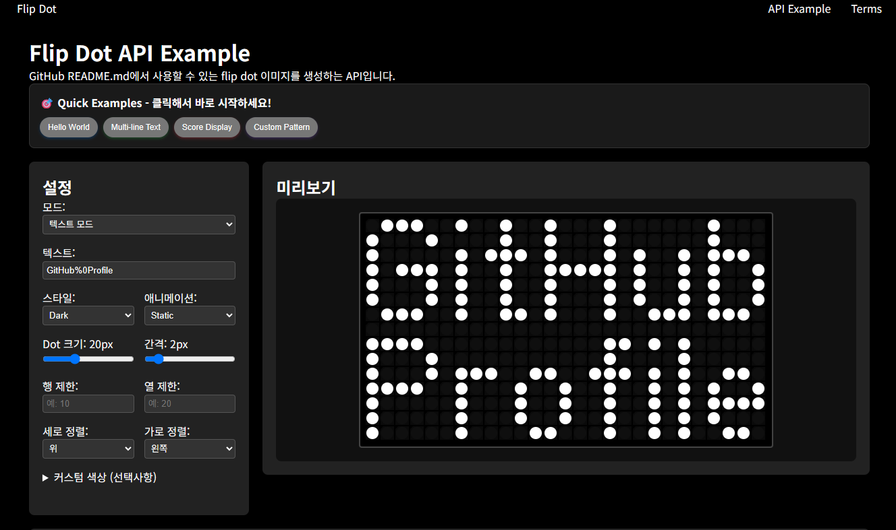

# 💿 Flip Dot Display

## 🌐 Other Languages
- [🇺🇸 English](../README.md)
- [🇰🇷 한국어 (Korean)](./README_kr.md)
- [🇯🇵 日本語 (Jap### 基本多行


### 三行文本


### 多行 + 动画
./README_jp.md)

<div align="center">
    <a href="https://flipdots.vercel.app/example"
        style="
            background-color : #222222;
            border : 3px solid black;
            color : white;
            width : 200px;
            border-radius : 40px;
            padding : 5px;
            display : flex;
            flex-direction : column;
            margin: 10px;
        "
    >
        try 💿 flip dot 💿 
    </a>         
</div>

<div align="center">
	<a href="https://github.com/Hangeol-Chang/flipdot"></a>
</div>

<div align="center">
    


</div>

<hr>
<div align="center">
    <h4> 用flip-dot显示屏装饰您的GitHub！ </h4>
    现在提供可直接在GitHub README.md中使用的动画SVG API！
    <br>
    <a href="https://flipdots.vercel.app/example">📖 查看API使用方法</a>
</div>
<br>

<!--  -->
<div align="center" style="maxWidth:400px">
 
</div>

## 🚀 主要功能

生成可直接嵌入GitHub README.md的flip dot图像的API。
再现真实flip-dot硬件的操作。

✨ **新功能**
- 🔤 **多行文本**: 用`%0A`换行
- 📐 **对齐选项**: 垂直/水平对齐选项
- 🎨 **自定义图案**: 设计您自己的点阵图案
- 🎬 **4种动画模式**: static、sequential、scroll、waterfall
- 🌈 **渐变**: 多种颜色的彩虹效果

### 基本用法

```markdown

```

### 多行文本

```markdown

```

### 动画

```markdown

```

## 📋 参数

| 参数 | 描述 | 默认值 | 示例 |
|------|------|--------|------|
| **`text`** | 要显示的文本（多行：用`%0A`分隔） | `HELLO` | `HELLO%0AWORLD` |
| **`customdots`** | 自定义点阵图案（1=开，0=关） | - | `10110,01001,10110` |
| **`style`** | 样式主题 | `dark` | `light`, `retro`, `modern`, `dark` |
| **`dotSize`** | 点大小（px） | `20` | `10-40` |
| **`spacing`** | 点间距（px） | `2` | `1-10` |
| **`row`** | 行数限制 | - | `10` |
| **`column`** | 列数限制 | - | `20` |
| **`align`** | 垂直对齐 | `start` | `start`, `center`, `end` |
| **`justify`** | 水平对齐 | `start` | `start`, `center`, `end` |
| **`animationMode`** | 动画模式 | `static` | `sequential`, `scroll`, `waterfall` |
| **`speed`** | 动画速度 | `1.0` | `0.5-3.0` |
| **`direction`** | 动画方向 | `normal` | `normal`, `reverse` |
| **`dotOn`** | 开启点的颜色（渐变：逗号分隔） | - | `ff0000` 或 `ff0000,00ff00,0000ff` |
| **`dotOff`** | 关闭点的颜色 | - | `333333` |
| **`background`** | 背景颜色 | - | `000000` |

## 🎭 样式示例

### 基本样式


### 自定义颜色


## 🎬 动画示例

### Sequential Animation（顺序动画）
像真实的flip-dot硬件一样，每个点顺序翻转


### Scroll Animation（滚动动画）
文本从右向左滚动


### Waterfall Animation（瀑布动画）
文本从上往下落下


## 📝 多行文本

使用`%0A`作为分隔符创建多行文本。每行之间会自动添加1个点的间距。

### 基本多行


### 3行文本


### 多行 + 动画


## 📐 尺寸限制和对齐

### 固定尺寸矩阵
通过限制行和列创建固定大小的显示屏。


### 居中对齐


### 多行对齐


## 🎨 自定义点阵图案

您可以直接定义点阵图案而不是文本。`1`表示开启的点，`0`表示关闭的点，行用逗号分隔。

### 心形


### 复选标记


### 星形


### 自定义图案 + 动画


## ✨ 特殊功能

### 空格和特殊字符
- **空格**: 使用空格或`_`（下划线）
- **特殊字符**: 支持`! ? . , : ; - + = * / \ ( ) [ ] @ # $ % &`
- **URL编码**: 即使在URL中自动编码的特殊字符也能正常处理


*注意: 在URL中`%`被编码为`%25`。*

## 💡 实用案例

### GitHub个人资料装饰

#### 访客欢迎信息


#### 当前状态显示


### 项目README标题

#### 项目标题


### 状态徽章样式

#### 构建状态


#### 版本信息


#### 进度显示


## 🛠️ 高级用法

### 对齐组合
您可以组合各种对齐选项来创建所需的布局：

```markdown
<!-- 左上 -->
?align=start&justify=start

<!-- 上中 -->
?align=start&justify=center

<!-- 右上 -->
?align=start&justify=end

<!-- 左中 -->
?align=center&justify=start

<!-- 中心 -->
?align=center&justify=center

<!-- 右中 -->
?align=center&justify=end

<!-- 左下 -->
?align=end&justify=start

<!-- 下中 -->
?align=end&justify=center

<!-- 右下 -->
?align=end&justify=end
```

### 渐变效果
通过用逗号分隔多种颜色来创建彩虹效果：


### 动画速度控制
使用speed参数控制动画速度：
```markdown
<!-- 慢动画 -->
&speed=0.5

<!-- 正常速度（默认） -->
&speed=1.0

<!-- 快动画 -->
&speed=2.0

<!-- 非常快的动画 -->
&speed=3.0
```

## 🎯 性能优化

### 推荐设置
- **dotSize**: 12-24px（太大会增加加载时间）
- **spacing**: 1-3px（保持适当的可读性）
- **动画**: 复杂文本推荐使用static模式
- **颜色**: 推荐使用6位hex代码（也支持3位）

### 加载速度改善
```markdown
<!-- 使用简单文本 -->
text=HELLO  （好）
text=VERY_LONG_COMPLEX_TEXT_WITH_MANY_CHARACTERS  （慢）

<!-- 适当的尺寸设置 -->
&dotSize=16&spacing=2  （好）
&dotSize=40&spacing=10  （慢）
```

## 📖 技术规格

### 支持的字符
- **大写字母**: A-Z
- **小写字母**: a-z  
- **数字**: 0-9
- **特殊字符**: `! ? . , : ; - + = * / \ ( ) [ ] @ # $ % &`
- **空格**: 空格，下划线(_)
- **多行**: %0分隔符

### 动画特性
- **Sequential**: 对角线顺序的顺序动画（0.08秒间隔）
- **Scroll**: 右→左滚动，每个字符0.5秒读取时间
- **Waterfall**: 上→下瀑布效果，按行顺序显示
- **Speed**: 0.5x ~ 3.0x速度调节可用
- **Direction**: normal/reverse方向切换

### 颜色系统
- **Hex代码**: 支持6位（#ffffff）或3位（#fff）
- **自动#添加**: URL中可以省略#符号
- **渐变**: 支持逗号分隔的多色
- **透明度**: 不支持rgba，仅支持hex

### 尺寸限制
- **dotSize**: 10-40px
- **spacing**: 1-10px  
- **row/column**: 无限制（性能考虑推荐100x100）
- **文本长度**: 无限制（可读性考虑推荐50字符以内）

### 浏览器兼容性
- **SVG支持**: 所有现代浏览器
- **动画**: 支持CSS3的浏览器
- **缓存**: 通过CDN快速加载
- **响应式**: 支持各种屏幕尺寸

## 🔧 开发者信息

### API端点
```
GET https://flipdots.vercel.app/api/svg
```

### 响应格式
- **Content-Type**: `image/svg+xml`
- **Cache-Control**: `public, max-age=31536000, immutable`
- **Encoding**: UTF-8

### 示例工具
您可以在[https://flipdots.vercel.app/example](https://flipdots.vercel.app/example)实时调整参数并查看结果。

### GitHub仓库
[https://github.com/Hangeol-Chang/flipdot](https://github.com/Hangeol-Chang/flipdot)

### 技术栈
- **Frontend**: Next.js 15, React 18
- **Styling**: CSS3 Animations, SVG
- **Deployment**: Vercel
- **Font Mapping**: 自定义位图字体

----
----

## 🤝 贡献

这个项目是开源的，我们欢迎您的贡献！

### 如何贡献
1. Fork这个仓库
2. 创建新的功能分支（`git checkout -b feature/amazing-feature`）
3. 提交您的更改（`git commit -m 'Add amazing feature'`）
4. 推送到分支（`git push origin feature/amazing-feature`）
5. 打开Pull Request

### 改进想法
- [ ] 中文字体支持
- [ ] 更多动画模式
- [ ] 自定义字体上传
- [ ] 二维码生成
- [ ] 图像转换为点阵图案
- [ ] 实时时钟显示
- [ ] 天气信息集成

### Bug报告
发现了bug？请在[Issues](https://github.com/Hangeol-Chang/flipdot/issues)中报告！

## 📄 许可证

此项目在MIT许可证下分发。详情请参见[LICENSE](../LICENSE)文件。

### 使用条件
- ✅ 允许商业使用
- ✅ 允许修改和分发  
- ✅ 允许个人项目使用
- ✅ 在GitHub README中自由使用

---

<div align="center">

**🎉 用flip-dot让您的GitHub README更精彩！🎉**

[](https://flipdots.vercel.app/example)

欢迎随时提交bug报告、想法和pull request。
<br>
📧 hgchang1@naver.com | 🐙 [@Hangeol-Chang](https://github.com/Hangeol-Chang)

⭐ 如果这个项目对您有帮助，请给我们一个星！

</div>
