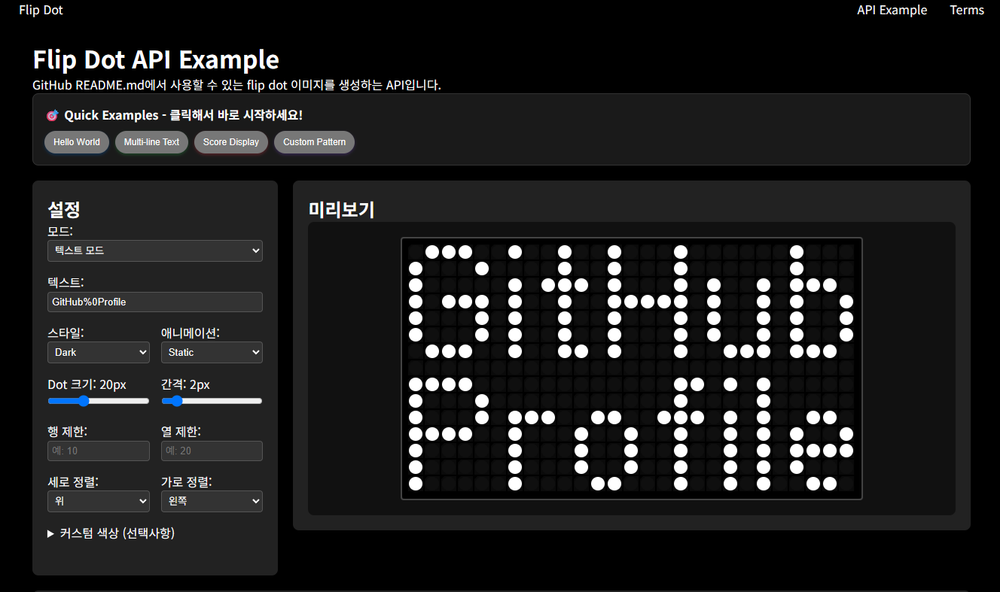

# 💿 Flip Dot Display

## 🌐 Other Languages
- [🇺🇸 English](../README.md)
- [🇰🇷 한국어 (Korean)](./README_kr.md)
- [🇨🇳 中文 (Chinese)](./README_cn.md)

## 📑 目次
- [🚀 主な機能](#主な機能)
- [🔷 ドット形状](#ドット形状)
- [📋 パラメータ](#パラメータ)
- [🎭 スタイル例](#スタイル例)
- [🎬 アニメーション例](#アニメーション例)
- [📝 複数行テキスト](#複数行テキスト)
- [📐 サイズ制限と配置](#サイズ制限と配置)
- [🎨 カスタムドットパターン](#カスタムドットパターン)
- [✨ 特殊機能](#特殊機能)
- [💡 実用的な使用例](#実用的な使用例)
- [🛠️ 高度な使用法](#高度な使用法)
- [💡 プロのヒント](#プロのヒント)
- [🎯 パフォーマンス最適化](#パフォーマンス最適化)
- [📖 技術仕様](#技術仕様)
- [🔧 開発者情報](#開発者情報)
- [🤝 コントリビュート](#コントリビュート)
- [📄 ライセンス](#ライセンス)

<div align="center">
    <a href="https://flipdots.vercel.app/example"
        style="
            background-color : #222222;
            border : 3px solid black;
            color : white;
            width : 200px;
            border-radius : 40px;
            padding : 5px;
            display : flex;
            flex-direction : column;
            margin: 10px;
        "
    >
        try 💿 flip dot 💿 
    </a>         
</div>

<div align="center">
	<a href="https://github.com/Hangeol-Chang/flipdot"></a>
</div>

<div align="center">
    


</div>

<hr>
<div align="center">
    <h4> flip-dot displayでGitHubを飾ってみましょう！ </h4>
    GitHub README.mdで直接使用できるアニメーションSVG APIを提供しています！
    <br>
    <a href="https://flipdots.vercel.app/example">📖 API使用方法を見る</a>
</div>
<br>

<!--  -->
<div align="center" style="maxWidth:400px">
 
</div>

## 🚀 主な機能

GitHub README.mdに直接埋め込むことができるflip dotイメージを生成するAPIです。
実際のflip-dotハードウェアの動作を再現します。

✨ **新機能**
- 🔤 **複数行テキスト**: `_`で改行
- 🔷 **ドット形状**: 4つのユニークなビジュアルスタイル — `circle`、`rect`、`rounded`、`diamond` — それぞれ独自のフリップアニメーション付き
- 🎬 **4つのアニメーションモード**: static、sequential、scroll、waterfall
- 🎨 **カスタムパターン**: 独自のドットパターンを設計（binaryまたはhex形式）
- 🌈 **グラデーション**: 複数の色で虹効果
- 📐 **配置オプション**: 縦/横配置オプション

### 基本的な使用法

```markdown

```

### 複数行テキスト

```markdown

```

### アニメーション

```markdown

```

## 📋 パラメータ

| パラメータ | 説明 | デフォルト | 例 |
|-----------|------|----------|---|
| **`text`** | 表示するテキスト（複数行：`_`で区切り） | `HELLO` | `HELLO_WORLD` |
| **`customdots`** | カスタムドットパターン — binary（`10110`）またはhex（`16`）形式 | - | `10110,01001` または `16,09,16` |
| **`style`** | スタイルテーマ | `dark` | `dark`, `light`, `retro`, `modern`, `neon`, `ocean`, `sunset` |
| **`dotSize`** | ドットサイズ（px） | `20` | `10-40` |
| **`spacing`** | ドット間隔（px） | `2` | `1-10` |
| **`dotShape`** | ドット形状 | `circle` | `circle`, `rect`, `rounded`, `diamond` |
| **`row`** | 行数制限 | - | `10` |
| **`column`** | 列数制限 | - | `20` |
| **`align`** | 縦配置 | `start` | `start`, `center`, `end` |
| **`justify`** | 横配置 | `start` | `start`, `center`, `end` |
| **`animationMode`** | アニメーションモード | `static` | `sequential`, `scroll`, `waterfall` |
| **`speed`** | アニメーション速度 | `1.0` | `0.5-3.0` |
| **`direction`** | アニメーション方向 | `normal` | `normal`, `reverse` |
| **`dotOn`** | オンドットの色（グラデーション：カンマ区切り） | - | `ff0000` または `ff0000,00ff00,0000ff` |
| **`dotOff`** | オフドットの色 | - | `333333` |
| **`background`** | 背景色 | - | `000000` |

## 🎭 スタイル例

### 基本スタイル


### カスタムカラー


## 🎬 アニメーション例

### Sequential Animation
実際のflip-dotハードウェアのように各ドットが順次反転


### Scroll Animation
テキストが右から左にスクロール


### Waterfall Animation
テキストが上から下に落下


## 📝 複数行テキスト

`_`を区切り文字として使用して複数行テキストを作成できます。各行の間には1ドットの間隔が自動的に追加されます。

### 基本的な複数行


### 3行テキスト


### 複数行 + アニメーション


## 📐 サイズ制限と配置

### 固定サイズマトリックス
行と列を制限して固定サイズのディスプレイを作成できます。


### 中央配置


### 複数行配置


## 🎨 カスタムドットパターン

テキストの代わりにドットパターンを直接定義できます。`1`はオンドット、`0`はオフドットを意味し、行はカンマで区切ります。

**2つの入力形式に対応しています:**

| 形式 | 例 | 説明 |
|------|-----|------|
| Binary | `00100000100` | 各文字が1ドット（0=オフ、1=オン） |
| Hex | `104` | hex1桁 = 4ビット — URLを約3倍短縮 |

> **自動検出**: `0`と`1`以外の文字（`2〜9`、`a〜f`）があればhexとして処理します。既存のbinary形式は引き続き使用できます。

**Hex変換例**（星形パターン、11列 → 3桁hex）:
```
Binary: 00100000100,00010001000,00111111100,01101110110,11111111111,10111111101,10100000101,00011011000
Hex:       104,     088,         0fc,         1b6,         7ff,         77d,         505,         0d8
```

### ハート形

```markdown
https://flipdots.vercel.app/api/svg?customdots=36,7f,7f,3e,1c,08&style=dark&dotOn=ff69b4&dotSize=20&spacing=2
```

### チェックマーク

```markdown
https://flipdots.vercel.app/api/svg?customdots=01,03,06,4c,78,30&style=modern&dotOn=00ff00&dotSize=18&spacing=2
```

### 星形

```markdown
https://flipdots.vercel.app/api/svg?customdots=104,088,0fc,1b6,7ff,77d,505,0d8&style=dark&dotOn=ffff00&dotSize=16&spacing=2
```

### カスタムパターン + アニメーション

```markdown
https://flipdots.vercel.app/api/svg?customdots=16,09,16&animationMode=sequential&style=retro&dotSize=22&spacing=3
```

## 🔷 ドット形状

`dotShape`パラメータで4つのビジュアルスタイルから選べます。各形状は独自のフリップアニメーションを持っています。

| 値 | 説明 |
|----|------|
| `circle` | 円形ドット（デフォルト） — 回転フリップ |
| `rect` | 四角形ドット — 対角軸フリップ、実際のflip-dotハードウェアの質感を再現 |
| `rounded` | 角丸四角形 — `rect`と同じフリップ、柔らかいエッジ |
| `diamond` | ひし形ドット — 回転フリップ |

### Circle（デフォルト）


### Rect
四角形ドット。対角線を軸にフリップし、機械的なflip-dotの質感をそのまま再現します。


### Rounded
`rect`と同じフリップ動作ですが、角が丸くよりソフトでモダンな外観です。


### Diamond


```markdown
https://flipdots.vercel.app/api/svg?text=HELLO&dotShape=rect&style=dark
https://flipdots.vercel.app/api/svg?text=HELLO&dotShape=rounded&style=retro
https://flipdots.vercel.app/api/svg?text=HELLO&dotShape=diamond&style=modern
```

## ✨ 特殊機能

### スペースと特殊文字
- **スペース**: 空白または`_`（アンダースコア）を使用
- **特殊文字**: `! ? . , : ; - + = * / \ ( ) [ ] @ # $ % &`をサポート
- **URLエンコーディング**: URLで自動エンコードされた特殊文字も正常に処理


*注意: URLでは`%`は`%25`としてエンコードされます。*

## 💡 実用的な使用例

### GitHubプロフィール装飾

#### 訪問者歓迎メッセージ


#### 現在のステータス表示


### プロジェクトREADMEヘッダー

#### プロジェクトタイトル


### ステータスバッジスタイル

#### ビルドステータス


#### バージョン情報


#### 進捗表示


## 🛠️ 高度な使用法

### 配置の組み合わせ
さまざまな配置オプションを組み合わせて目的のレイアウトを作成できます：

```markdown
<!-- 左上 -->
?align=start&justify=start

<!-- 上中央 -->
?align=start&justify=center

<!-- 右上 -->
?align=start&justify=end

<!-- 左中央 -->
?align=center&justify=start

<!-- 中央 -->
?align=center&justify=center

<!-- 右中央 -->
?align=center&justify=end

<!-- 左下 -->
?align=end&justify=start

<!-- 下中央 -->
?align=end&justify=center

<!-- 右下 -->
?align=end&justify=end
```

### グラデーション効果
複数の色をカンマで区切って虹効果を作成：


### アニメーション速度制御
speedパラメータでアニメーション速度を制御：
```markdown
<!-- 遅いアニメーション -->
&speed=0.5

<!-- 通常速度（デフォルト） -->
&speed=1.0

<!-- 速いアニメーション -->
&speed=2.0

<!-- 非常に速いアニメーション -->
&speed=3.0
```

## 🎯 パフォーマンス最適化

### 推奨設定
- **dotSize**: 12-24px（大きすぎると読み込み時間が増加）
- **spacing**: 1-3px（適切な可読性を維持）
- **アニメーション**: 複雑なテキストにはstaticモードを推奨
- **色**: 6桁のhexコードを推奨（3桁もサポート）

### 読み込み速度の改善
```markdown
<!-- シンプルなテキストを使用 -->
text=HELLO  （良い）
text=VERY_LONG_COMPLEX_TEXT_WITH_MANY_CHARACTERS  （遅い）

<!-- 適切なサイズ設定 -->
&dotSize=16&spacing=2  （良い）
&dotSize=40&spacing=10  （遅い）
```

## 📖 技術仕様

### サポート文字
- **英大文字**: A-Z
- **英小文字**: a-z  
- **数字**: 0-9
- **特殊文字**: `! ? . , : ; - + = * / \ ( ) [ ] @ # $ % &`
- **スペース**: 空白、アンダースコア(_)
- **複数行**: _区切り文字

### アニメーション機能
- **Sequential**: 対角線順序で順次アニメーション（0.08秒間隔）
- **Scroll**: 右→左スクロール、文字ごと0.5秒読み取り時間
- **Waterfall**: 上→下の滝効果、行ごと順次表示
- **Speed**: 0.5x〜3.0x速度調整可能
- **Direction**: normal/reverse方向切り替え

### カラーシステム
- **Hexコード**: 6桁（#ffffff）または3桁（#fff）サポート
- **自動#追加**: URLで#記号を省略可能
- **グラデーション**: カンマ区切りの複数色サポート
- **透明度**: rgbaは未サポート、hexのみ

### サイズ制限
- **dotSize**: 10-40px
- **spacing**: 1-10px  
- **row/column**: 制限なし（パフォーマンス上100x100推奨）
- **テキスト長**: 制限なし（可読性上50文字以内推奨）

### ブラウザ互換性
- **SVGサポート**: すべての現代ブラウザ
- **アニメーション**: CSS3サポートブラウザ
- **キャッシュ**: CDNによる高速読み込み
- **レスポンシブ**: さまざまな画面サイズサポート

## 🔧 開発者情報

### APIエンドポイント
```
GET https://flipdots.vercel.app/api/svg
```

### レスポンス形式
- **Content-Type**: `image/svg+xml`
- **Cache-Control**: `public, max-age=31536000, immutable`
- **Encoding**: UTF-8

### 例ツール
[https://flipdots.vercel.app/example](https://flipdots.vercel.app/example)でリアルタイムでパラメータを調整し、結果を確認できます。

### GitHubリポジトリ
[https://github.com/Hangeol-Chang/flipdot](https://github.com/Hangeol-Chang/flipdot)

### 技術スタック
- **Frontend**: Next.js 15, React 18
- **Styling**: CSS3 Animations, SVG
- **Deployment**: Vercel
- **Font Mapping**: カスタムビットマップフォント

----
----

## 🤝 貢献

このプロジェクトはオープンソースで、皆様の貢献を歓迎します！

### 貢献方法
1. このリポジトリをForkしてください
2. 新しい機能ブランチを作成してください（`git checkout -b feature/amazing-feature`）
3. 変更をコミットしてください（`git commit -m 'Add amazing feature'`）
4. ブランチにプッシュしてください（`git push origin feature/amazing-feature`）
5. Pull Requestを開いてください

### 改善アイデア
- [ ] 日本語フォントサポート
- [ ] より多くのアニメーションモード
- [ ] カスタムフォントアップロード
- [ ] QRコード生成
- [ ] 画像をドットパターンに変換
- [ ] リアルタイム時計表示
- [ ] 天気情報連携

### バグレポート
バグを発見しましたか？[Issues](https://github.com/Hangeol-Chang/flipdot/issues)でレポートしてください！

## 📄 ライセンス

このプロジェクトはMITライセンスの下で配布されています。詳細は[LICENSE](../LICENSE)ファイルを参照してください。

### 使用条件
- ✅ 商用利用可能
- ✅ 修正および配布可能  
- ✅ 個人プロジェクト使用可能
- ✅ GitHub READMEで自由に使用可能

---

<div align="center">

**🎉 flip-dotでGitHub READMEを素晴らしく！🎉**

[](https://flipdots.vercel.app/example)

バグレポート、アイデア、プルリクエストはいつでも歓迎です。
<br>
📧 hgchang1@naver.com | 🐙 [@Hangeol-Chang](https://github.com/Hangeol-Chang)

⭐ このプロジェクトが役に立ったら、スターをお願いします！

</div>
